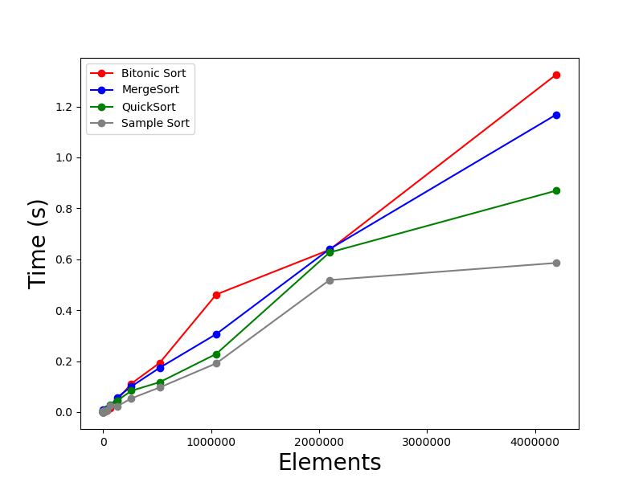

# Group 18 High Performance Data and Computing Project


Clone Code
```
git clone https://github.com/InvincibleRMC/csds438.git
```

## Batch Job
Submit Batch Job
```
sbatch job.slurm
```
## Manual
Compile Code 
```
gcc main_openmp.c -fopenmp -lm -O3 -o main_openmp
```
Generate Data
```
./main_openmp
```


## Analyze Sorting Algorithms
```
python3 analysis.py
```
# Examples
 
