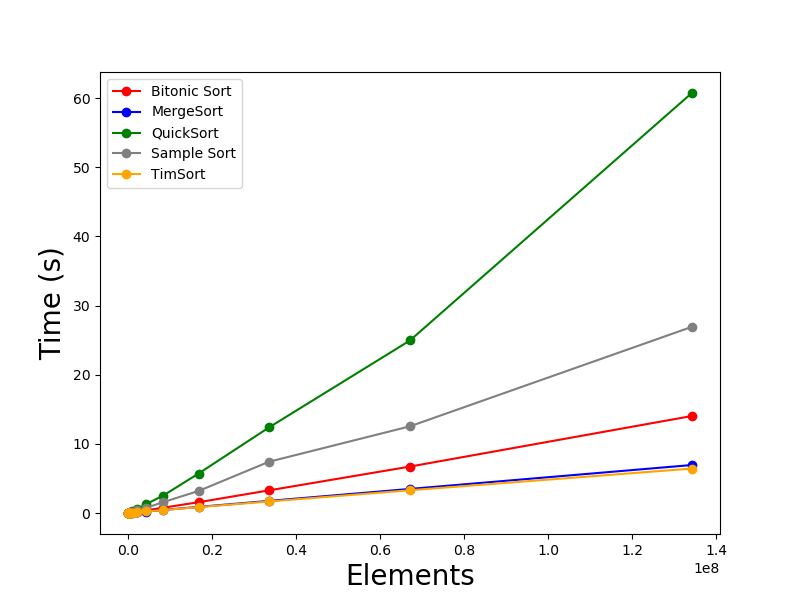

# Group 18 High Performance Data and Computing Project

Compile Code 
```
gcc c_version/main_openmp.c -fopenmp -O3 -o main_openmp
```
Generate Data
```
./main_openmp
```
Analyze Sorting Algorithms
```
python3 analysis.py
```
# Examples
 
